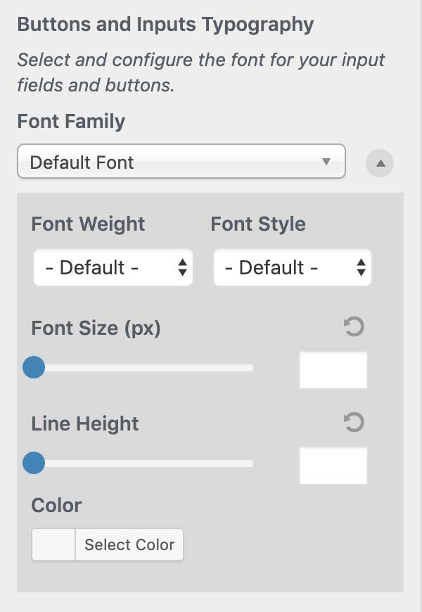

# Buttons and Inputs Typography

`Appearance` → `Customize`→ `Google Fonts` → `Basic Settings`

The Buttons and Inputs control allows you to customize the typography of the following:

* Buttons
* Inputs
* Search Fields
* Form Fields



```text
The following CSS selectors are targeted: button, input, select, textarea
```

