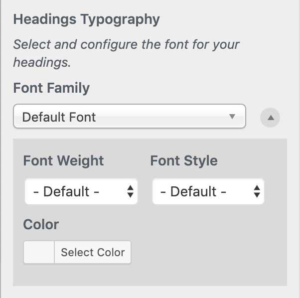

# Headings Typography

`Appearance` → `Customize`→ `Google Fonts` → `Basic Settings`

The 'Headings Typography' control doesn't have a font size control as it modifies **all** heading types.



Clicking the blue icon to the left of the ‘Font Family’ will reveal additional typography controls: Font weight, style, size, color and line-height settings.


If your changes aren’t taking effect, you may need to enable the [‘Force Styles’ setting](../debugging/force-styles-setting.md).


```text
The following CSS selectors are targeted: #site-title, .site-title, #site-title a, .site-title a, .entry-title, .entry-title a, h1, h2, h3, h4, h5, h6, .widget-title
```

