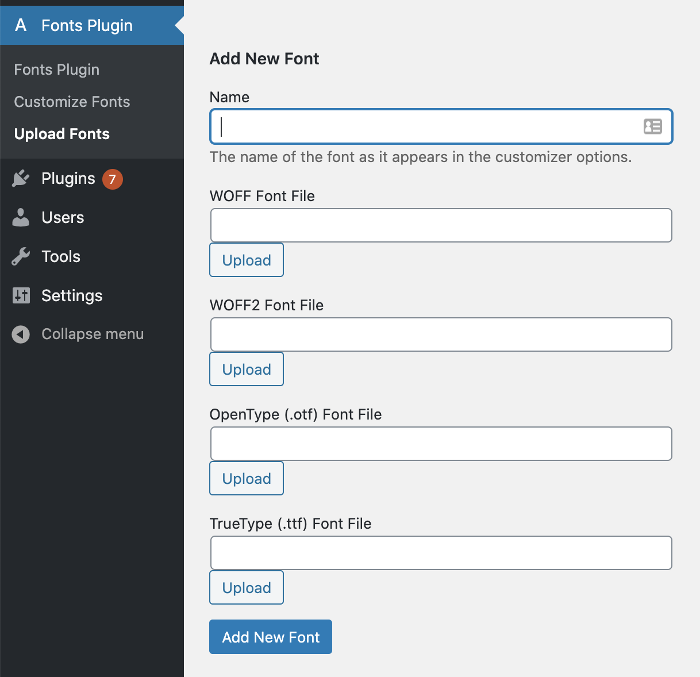
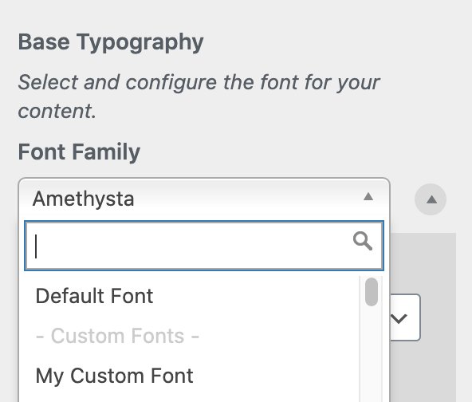
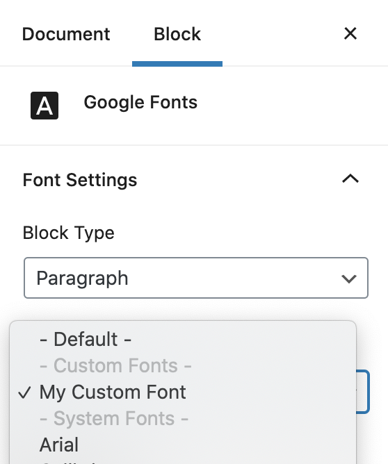
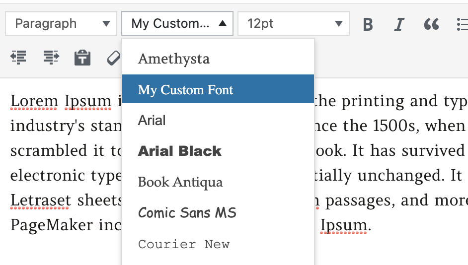

# Custom Font Uploads

Using the new 'Upload Fonts' interface Pro users can easily upload fonts and then immediately use them in the Customizer, Classic Editor and Gutenberg.

To upload a font, navigate to the 'Upload Fonts' section of the Fonts Plugin menu:

The interface allows you to upload all of the most widely used and supported formats.&#x20;

You don't need to upload all four file types. We recommend prioritising WOFF and WOFF2 as they are the most optimized.

If your font files are not in those formats you can use this tool to convert them - [https://www.fontsquirrel.com/tools/webfont-generator](https://fontsplugin.us9.list-manage.com/track/click?u=1ed15f4383eb532a1a1034fb9\&id=207a65583b\&e=c8d9cc9fbb)

Once you have added a font it will be instantly available in all of the different interfaces:

### **Customizer**

### **Gutenberg**

### **Classic Editor**

