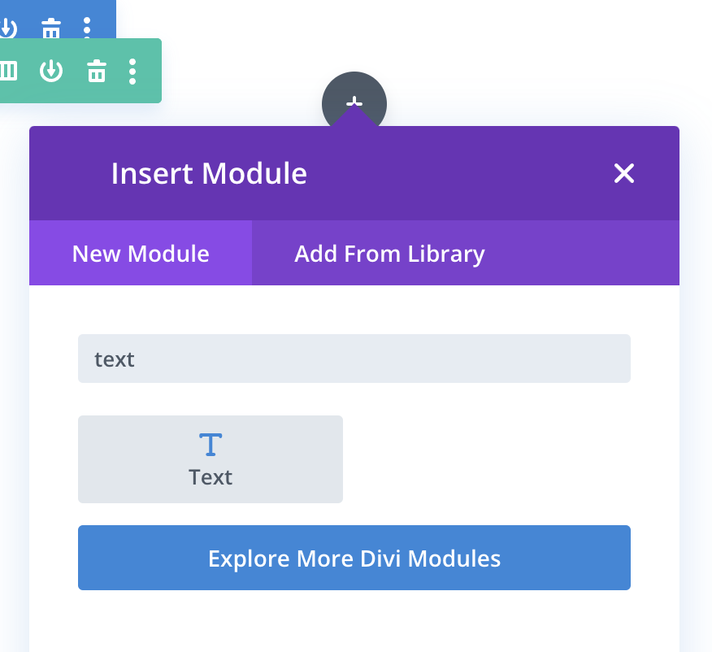

# Divi Builder

First, either upload your font files or connect to Adobe Fonts:





Next, when editing a page choose a 'Text' module within Divi:

<figure><figcaption></figcaption></figure>

Next, click the 'Design' tab:

<figure><figcaption></figcaption></figure>

The fonts you have added will now be displayed in the 'Text Font' dropdown.
