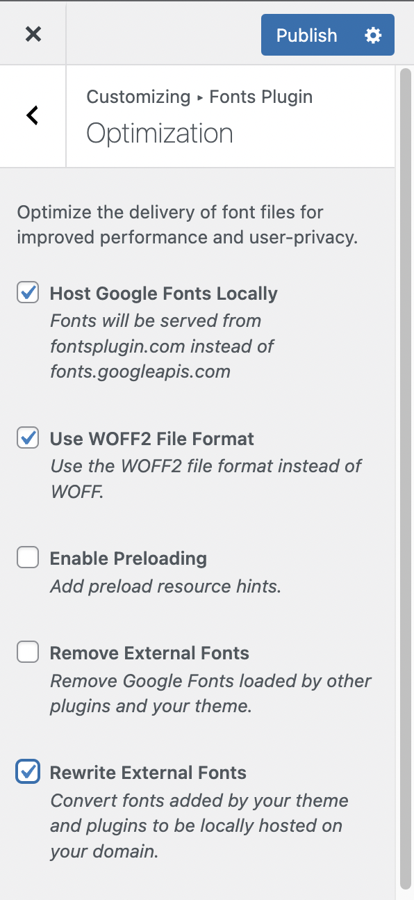

# Optimization Panel

Located at `Appearance` → `Customize` → `Fonts Plugin` → `Optimization`.

### Host Fonts Locally

The local hosting feature allows you to host the fonts from your own server instead of Google’s. As well as being GDPR-friendly, this can also have performance benefits.

Enabling local hosting is a simple 1-click process.

Simply toggle the checkbox to the `on` position.

Press `Publish` and the plugin will do all the work in the background.

Font Files are cached on your server for **1 year** and they are regenerated each time you change fonts. If you need to re-generate the font files manually that is also possible:&#x20;

Navigate to https://yourwebsite.com/?action=fpp-reset-cache\
_(replace yourwebsite.com with your own URL)_

### Use WOFF2 File Format

By default Fonts Plugin uses the WOFF file format as it has the [highest compatibility across all browsers](https://caniuse.com/#search=woff).&#x20;

However, there is a more optimized file format that all modern browsers support, [WOFF2](https://caniuse.com/woff2). In our testing it reduces all font file sizes by at least 30%.

To enable WOFF2, toggle the switch:

You will then need to clear your font cache by navigating to https://yourwebsite.com/?action=fpp-reset-cache\
_(replace yourwebsite.com with your own URL)_

### Enable Preloading

Preload Resource Hints are a browser feature that allows your website to specify the resources it needs to render the page. With preloading enabled, the browser knows that it needs to download the fonts as soon as possible, this ensures your text renders as quickly as possible and that there is no [flash of unstyled text](https://fonts.google.com/knowledge/glossary/fout).&#x20;

### Remove External Fonts

Fonts Plugin Pro loads your fonts in the most optimized way possible. For that reason you don't want to also have your theme and plugins also loading fonts in an unoptimized way. Enabling this setting removes all font references that aren't from Fonts Plugin Pro.

### Rewrite External Fonts

If you want to continue using the fonts supplied by your theme or plugins, the most optimal way is to enable the 'Remove External Fonts' setting and then add your fonts using the [Load Fonts Only](https://docs.fontsplugin.com/advanced-settings/load-fonts-only) feature.&#x20;

However, if you are short on time and are looking for an instant solution, enabling this option will rewrite all your fonts to be hosted locally. This has the benefit of improving pagespeed and protecting your website visitors privacy, as it removes the connect to the Google Fonts API.
