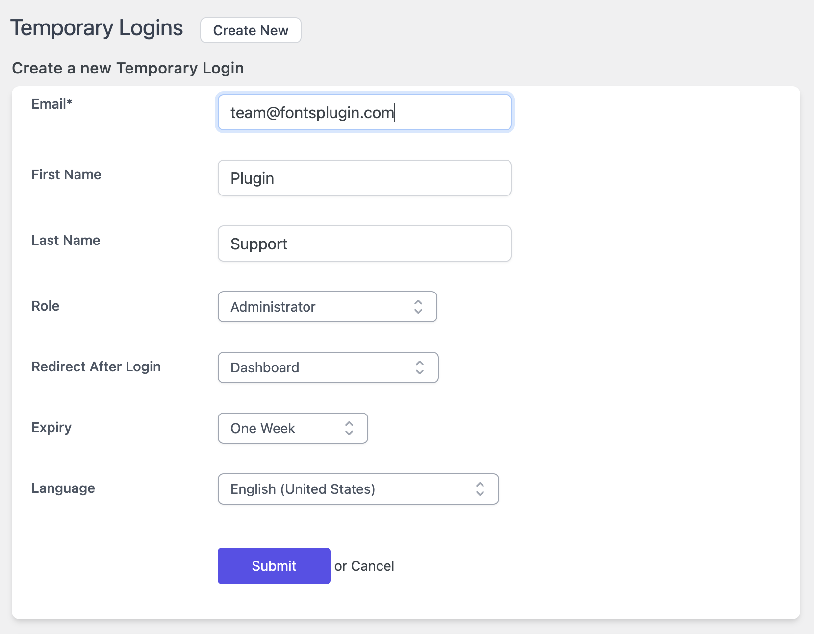

---
layout:
  title:
    visible: true
  description:
    visible: false
  tableOfContents:
    visible: true
  outline:
    visible: true
  pagination:
    visible: true
---

# Support Access

We try to minimize sending passwords via email because we value security and privacy. We’ve chosen the [Temporary Login Without Password](https://wordpress.org/plugins/temporary-login-without-password/) plugin to help us achieve this goal. With that plugin, it’s possible to create a special link with which we can log in without the need for a username and password.&#x20;

1. In your WordPress backend, go to Plugins -> Add new. Search for “temporary login without password” and click the “Install Now” button.
2. After installing, click the “Activate now” button.
3. After activating, we can go to the temporary login settings. Navigate to Users -> Temporary Logins.
4. Click the “Create new” button first. Some entry fields show up. Fill out the email address with team@fontsplugin.com The role should be Administrator and the expiry can be set to one week (which is the default setting). Please set the Language to English (United States). After filling the form, you can click submit to complete the creation of a new temporary login.
5. After submitting the form, please click the copy button and share the link with us. We’ll be able to log in without any passwords sent via email and the Admin account will be automatically removed after 1 week.

<figure><figcaption></figcaption></figure>
